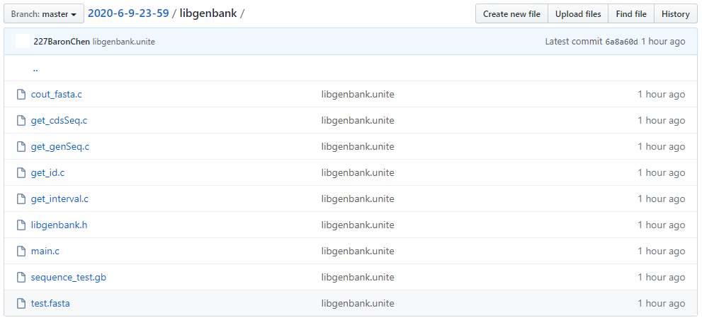

组装函数：`CDS（编码区）` &  `1个.h文件, 6个.c文件`

```shell
gcc libgenbank.h get_id.c get_interval.c get_genSeq.c get_cdsSeq.c cout_fasta.c main.c 
```

>  

1. `sequence_test.gb`：测试文件，`test.fasta`：输出文件
2. `libgenbank.h`：头文件
3. `get_id.c`（`zly`）：提取`CDS`的`protein_id`的函数`get_id`。
4. `get_interval.c`（`lyh`）：提取`CDS`的起始(左值)和结束(右值)位置的函数`get_interval`。
5. `get_genSeq.c`（`yjc`）：提取`从origin到//`的完整基因组序列的函数`get_genSeq`。
6. `get_cdsSeq.c`（`zly`）：提取`CDS`的`sequence`的函数`get_cdsSeq`，需要用到函数`get_interval`和函数`get_genSeq`的输出。
7. `cout_fasta.c`：有关输出的一些函数（包括`.fasta`的输出）
8. `main.c`：测试。
